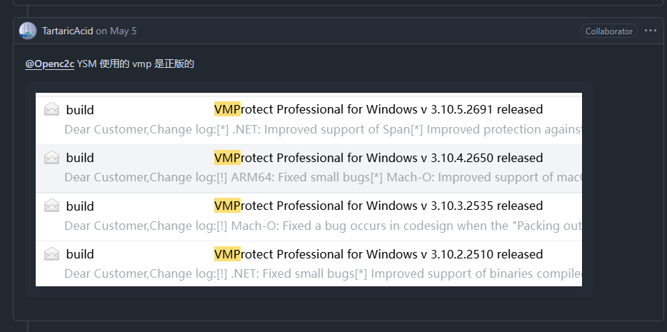
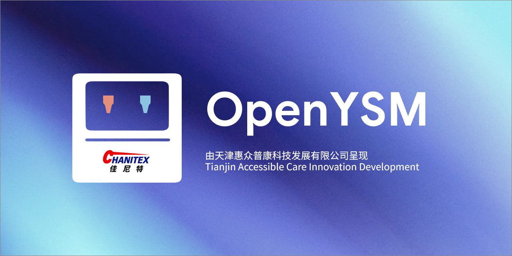

# Farewell thoughts

YSM已经官方开源，我们的目标已经达成，所以是时候收场了。

**说好了要进行一场别样的迭代大战，现在怎么跑路了？**

**这确实是我们原本的想法，但是现在YSM官方开源了，我们应该让步**，对于我们对YSM的改进，例如UI改进，加载改进，内存优化，GPU渲染等我们相信官方开源的YSM也会逐步实现，所以，我们的目标达成了，我们跑路了！没必要留恋，抛下执念转向官方的生态，才是正确的。

## 开源到底是不是"既定的"

YSM最终转向开源是我们两个月以来施压的结果，一些TartaricAcid先生的孝子贤孙总是用"YSM其实早就想开源了，开源是既定的"这种愚蠢的借口否定我们的努力，我只想说我相信如果没有YSMParser/OpenYSM出现YSM几年内都不可能开源，如果开源是既定的，何必继续花几千元续费花费5000人民币购买的VMProtect。

许多人在指点江山之前并不了解VMProtect的付费机制，首次购买后发放的版本本身即可永久使用，每年续费只是为获取更新服务，即便不续费，原有版本也不受影响。如果不追求更新，可一直正常使用。所以"因续费不起VMProtect而开源"的说法根本站不住脚。更何况近期更新内容几乎都与ARM/MacOS支持相关，[而作为一个官方能说出玩游戏就好好用windows的mod我相信他们根本不会在意MacOS用户](https://web.archive.org/web/20240730025323/https://github.com/TartaricAcid/ysm/issues/79)，根本无需为此续费。他们续费就是还想用最新的VMProtect继续保护这一套模型壳子。（无法防止倒卖，只能防止修改，然而倒卖的人根本没心情修改）

YSM的团队看到开源版本蓬勃发展，各种改进与移植层出不穷时，他们意识到如果不做一个官方开源抢占生态迟早会被OpenYSM篡位，闭源版本那么几个人（可能高达一个甚至两个）开发不可能写的过开源社区，开源社区有的是人乐意去移植到他们从来没有关心过的版本，[支持他们从来不支持的操作系统](https://web.archive.org/web/20240730025323/https://github.com/TartaricAcid/ysm/issues/79)，看到自己的生态风雨飘摇了，才会决定开源。

**我们研究他的加密，实现解密，反渲染，以及重新实现YSM新版本的所有功能，都是我们为了这个目标付出的努力，不能被开源是既定的否定，我们相信如果YSMParser/OpenYSM不出现，YSM几年之内都不能开源，这种破坏自己亲手建立起来的秩序的行为任何人都干不出来。**



当然无论如何，开源是一个Mod发展的正道，不说完成度怎么样，开源了就是好，TartaricAcid、番茄布丁等YSM开发者就此事最终做了一个正确的决定，致敬。

# 原始README

<div align="center">
  
  <h2>OpenYSM</h2>
  <p>YSM 开源替代品，基于LgeacyYSM</p>

  <p>
    <a href="LICENSE"></a>
    <a href="https://t.me/NoSteveModel"></a>
  </p>
</div>

## 说明

OpenYSM 是一款基于 [Yes Steve Model](https://modrinth.com/mod/yes-steve-model) 的模组，它修改了原版玩家模型，其核心使用 [GeckoLib](https://github.com/bernie-g/geckolib) 库，并采用了 Minecraft 基岩版的模型和动画文件。这使得玩家可以根据自己的喜好自定义玩家模型和动画。

本项目基于LgeacyYSM，目标是提供一个完全开源、可自由修改和分发的替代品。 
本项目使用可选的C++库实现更快速的渲染，项目位于[OpenYSMDev/openysm.cpp](https://github.com/OpenYSMDev/openysm.cpp)

## 构建

```bash
git clone https://github.com/OpenYSMDev/ModernYSM.git
cd ModernYSM
./gradlew build
```

构建产物位于 `build/<platform>/libs/` 目录下。

## 贡献

欢迎任何形式的贡献，包括但不限于提交 Issue、改进文档、修复 Bug、新增功能。

## 开源协议

### 源代码协议

本项目的源代码采用 MIT License 开放，您可以自由地使用、修改和分发代码，仅需要保留原始的版权声明。

详细的许可证条款请参见 [LICENSE](LICENSE) 文件。

### 模型资源协议

仓库中自带的模型文件采用不同的协议：

- 默认模型: 采用 CC0 (Creative Commons Zero) 协议，完全开放，无任何使用限制
- 酒狐 (Wine Fox) 模型: 采用 CC BY-NC-SA 4.0 协议，允许非商业使用，需要署名，并且衍生作品需要采用相同协议

请在使用相应模型时严格遵守对应的协议要求。
